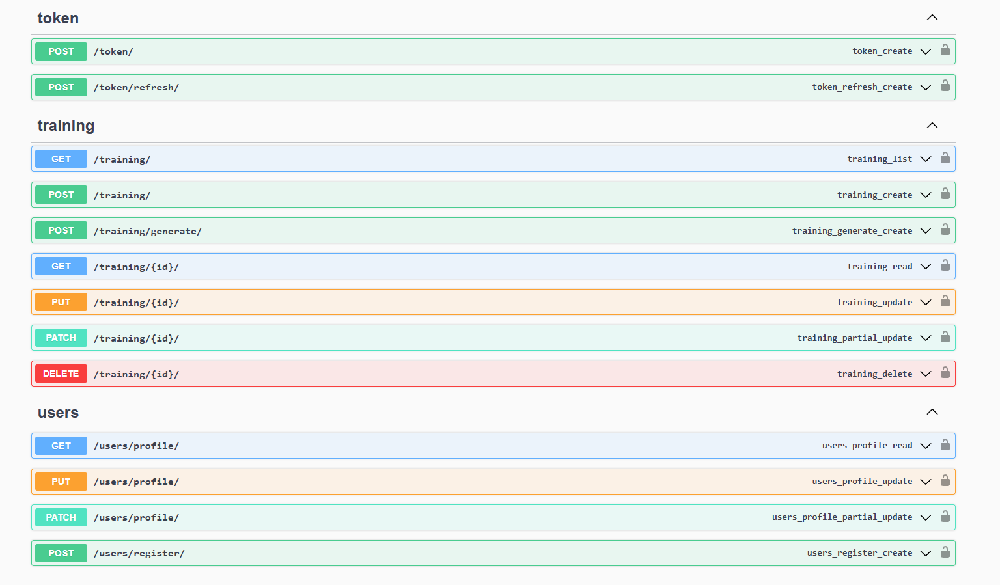

# Notes API 📝
API REST CRUD de Notas desarrollada con FastAPI, SQLAlchemy y Pydantic. Sistema de gestión de notas personales implementando operaciones CRUD completas, migraciones con Alembic, tests automatizados y siguiendo las mejores prácticas de desarrollo.

## 🚀 Características
- CRUD completo para notas
- Validación de datos con Pydantic
- Sistema de migraciones con Alembic
- Tests automatizados
- Documentación interactiva con Swagger/OpenAPI
- Soft delete para preservar datos

## 🛠️ Tecnologías Utilizadas
- Python 3.x
- FastAPI
- SQLAlchemy
- Pydantic
- Alembic
- SQLite3
- Pytest

## 📂 Estructura del Proyecto
```
notes_api/
├── app/
│   ├── __init__.py
│   ├── database.py    # Configuración de SQLAlchemy
│   ├── models.py      # Modelos SQLAlchemy
│   ├── routes.py      # Endpoints de la API
│   └── schemas.py     # Schemas Pydantic
├── tests/
│   ├── __init__.py
│   ├── conftest.py    # Configuración de tests
│   └── test_api.py    # Tests de endpoints
├── alembic/           # Migraciones
├── main.py           # Punto de entrada
└── requirements.txt  # Dependencias
```

## 📥 Instalación

### 1. Clonar el repositorio:
```bash
git clone https://github.com/Jaolmos/notes-fastapi.git
cd notes-fastapi
```

### 2. Crear y activar entorno virtual:
```bash
python -m venv venv
source venv/bin/activate  # Linux/Mac
venv\Scripts\activate     # Windows
```

### 3. Instalar dependencias:
```bash
pip install -r requirements.txt
```

### 4. Ejecutar migraciones:
```bash
alembic upgrade head
```

### 5. Iniciar el servidor:
```bash
uvicorn main:app --reload
```

## 📚 Documentación API
La API está completamente documentada usando Swagger/OpenAPI.

### Endpoints Disponibles


#### Notes
- `GET /api/notes` - Obtener todas las notas
- `POST /api/notes` - Crear nueva nota
- `GET /api/notes/{note_id}` - Obtener nota específica
- `PUT /api/notes/{note_id}` - Actualizar nota
- `DELETE /api/notes/{note_id}` - Eliminar nota

### Schemas
- `NoteCreate` - Schema para crear notas
- `NoteUpdate` - Schema para actualizar notas
- `NoteResponse` - Schema de respuesta
- `ValidationError` - Schema de errores de validación

La documentación interactiva está disponible en:
- `http://localhost:8000/docs` - Interfaz Swagger UI donde puedes:
  - Ver todos los endpoints
  - Probar las operaciones directamente
  - Consultar los schemas
  - Ver ejemplos de peticiones y respuestas

## 🧪 Tests
Para ejecutar los tests:
```bash
pytest -v
```

## 💡 Ejemplos de Uso
Puedes probar los endpoints usando:

1. Swagger UI (recomendado): Accede a `/docs` para una interfaz interactiva
2. Postman: Importa la colección de endpoints
